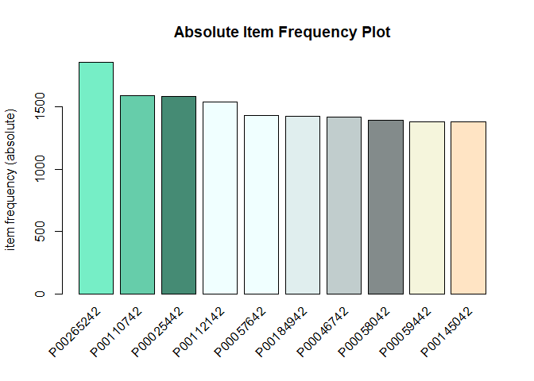
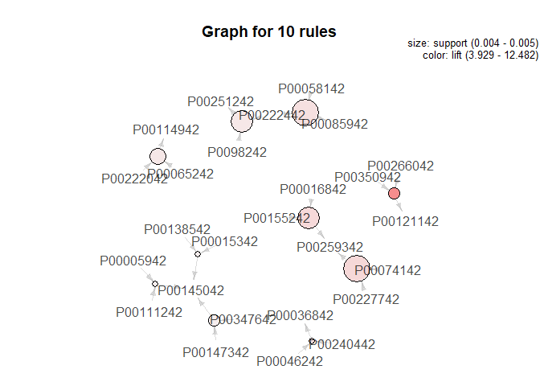
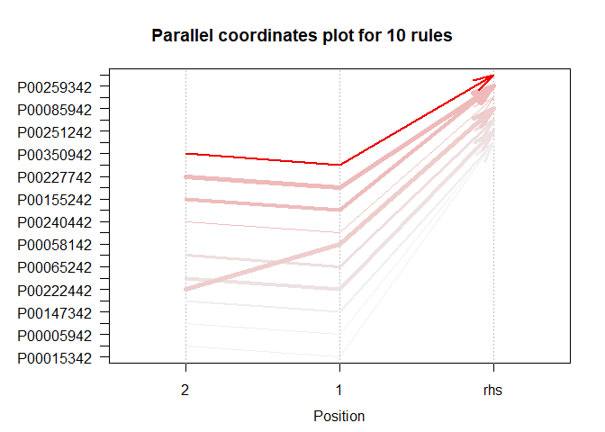

   

 *Market Basket Analysis* 
----------------------------------------------------------

### **Apriori Algorithm**

Using this Apriori algorithm we can predict what products customers buy
together. This is Associations Rule Mining. The purpose of using
Associations Rule Mining is found in retailing, clustering and
classification.

Store owners can use association rules for numerous marketing strategies
for example:  
\* changing the store layout,  
\* customer behavior analysis,  
\* what are the trending items customers buy?

### Application in R

Firstly we have to get information about transactions from data. Each
transaction shows items bought in that transaction and wchich User ID.

#### **Prepare data**

First it's important to convert data frame into transaction data
(transaction object --&gt; `basket`).

    products     <- data$Product_ID
    users        <- as.factor(data$User_ID)
    sparse_matix <- split(products, users)
    basket       <- as(sparse_matix, "transactions")

Here some information about new object `basket`. There are 5891
transactions (rows) and 3623 items (columns).

    summary(basket)

    ## transactions as itemMatrix in sparse format with
    ##  5891 rows (elements/itemsets/transactions) and
    ##  3623 columns (items) and a density of 0.0251874 
    ## 
    ## most frequent items:
    ## P00265242 P00110742 P00025442 P00112142 P00057642   (Other) 
    ##      1858      1591      1586      1539      1430    529573 
    ## 
    ## element (itemset/transaction) length distribution:
    ## sizes
    ##    5    6    7    8    9   10   11   12   13   14   15   16   17   18   19 
    ##    1    5    7   20   37   55   77   78  120  113  121  104  122  118   94 
    ##   20   21   22   23   24   25   26   27   28   29   30   31   32   33   34 
    ##   79   93   85   77   66   74   84   72   72   74   77   58   50   58   39 
    ##   35   36   37   38   39   40   41   42   43   44   45   46   47   48   49 
    ##   63   56   53   40   55   57   51   44   49   37   42   41   43   38   36 
    ##   50   51   52   53   54   55   56   57   58   59   60   61   62   63   64 
    ##   32   36   41   40   49   51   30   43   35   26   30   24   27   27   48 
    ##   65   66   67   68   69   70   71   72   73   74   75   76   77   78   79 
    ##   32   30   29   16   31   30   40   25   27   24   30   31   30   19   25 
    ##   80   81   82   83   84   85   86   87   88   89   90   91   92   93   94 
    ##   20   21   23   23   30   22   14   20   20   20   14   18   28   20   22 
    ##   95   96   97   98   99  100  101  102  103  104  105  106  107  108  109 
    ##   27   17   15   13   16   20   20   12   13   13   11   12   17   21   18 
    ##  110  111  112  113  114  115  116  117  118  119  120  121  122  123  124 
    ##   12   15   19    8   23   18   17   10   15   19    9   10   14    5   18 
    ##  125  126  127  128  129  130  131  132  133  134  135  136  137  138  139 
    ##   11    7    9   14    7   21    6   13   11   10   13   15   12    6    4 
    ##  140  141  142  143  144  145  146  147  148  149  150  151  152  153  154 
    ##    8   12   13   15    4    5    7    8    9    9   11    8    7    6   12 
    ##  155  156  157  158  159  160  161  162  163  164  165  166  167  168  169 
    ##    5    6    7   10   11    6    9   11   11    9   12    4    7    8   11 
    ##  170  171  172  173  174  175  176  177  178  179  180  181  182  183  184 
    ##   16   12    7   10    6   10    6    4   11    9    7    4    6    7    9 
    ##  185  186  187  188  189  190  191  192  193  194  195  196  197  198  199 
    ##    4    5    5   11    4    5    3    4    5    4    5    5    7    4    5 
    ##  200  201  202  203  204  205  206  207  208  209  210  211  212  213  214 
    ##    2    7    7    4    6    6   10    5   11    3    6    6    2    3    5 
    ##  215  216  217  218  219  220  221  222  223  224  225  226  227  228  229 
    ##    4    5    7    5    4    3    4    7    4    4    3    9    5    5    8 
    ##  230  231  232  233  234  235  236  237  238  239  240  241  242  243  244 
    ##    3    5    3    2    5    5    6    3    3    5    5    4    3    7    4 
    ##  245  246  247  248  249  250  251  252  253  254  255  256  257  258  259 
    ##    2    3    3    2    2    4    3    1    3    2    2    5    2    3    2 
    ##  260  261  263  264  265  266  267  268  269  270  271  272  273  274  275 
    ##    4    3    5    1    2    6    2    6    6    4    3    2    3    5    5 
    ##  276  277  279  280  281  282  283  284  285  286  287  288  289  290  291 
    ##    1    1    6    4    7    6    1    4    3    6    4    2    6    5    1 
    ##  292  294  295  296  297  298  299  300  301  302  303  304  305  306  307 
    ##    2    3    3    1    2    5    2    1    1    2    5    3    3    2    1 
    ##  308  309  310  311  312  314  315  316  317  318  319  320  321  322  324 
    ##    1    2    2    5    4    2    2    3    2    2    1    1    3    1    2 
    ##  325  326  327  329  330  332  333  334  335  336  337  338  339  341  342 
    ##    1    1    1    1    2    1    1    1    1    2    2    5    4    4    2 
    ##  343  345  346  347  348  350  352  353  354  355  356  357  358  359  360 
    ##    2    3    3    2    1    1    3    1    2    4    2    1    2    1    1 
    ##  361  362  363  365  366  367  370  371  376  377  378  379  380  381  382 
    ##    3    1    2    1    1    2    3    1    1    4    1    3    2    1    2 
    ##  383  384  386  389  390  391  392  399  401  404  405  406  407  408  409 
    ##    1    2    2    2    5    1    6    1    1    2    3    1    2    1    1 
    ##  410  411  412  414  416  417  420  422  423  426  427  429  430  431  432 
    ##    2    1    2    1    1    2    1    1    1    1    2    3    1    1    1 
    ##  433  434  435  436  438  440  441  444  446  447  449  450  452  454  457 
    ##    1    1    5    3    2    1    1    2    3    2    1    4    2    3    1 
    ##  458  461  466  468  469  470  471  475  476  478  479  484  485  486  487 
    ##    3    1    2    1    1    2    1    1    3    1    1    1    3    2    1 
    ##  489  491  492  493  494  496  497  498  500  501  517  526  529  533  537 
    ##    1    1    1    2    1    1    2    1    2    1    1    2    3    2    2 
    ##  543  547  548  549  557  558  559  565  568  570  572  574  575  583  587 
    ##    1    1    1    1    2    2    1    1    1    1    1    1    1    1    1 
    ##  605  616  622  631  651  667  670  676  679  680  684  690  694  697  705 
    ##    1    1    1    1    1    1    1    1    1    1    1    1    1    2    1 
    ##  708  714  717  739  752  766  822  861  898  978 1025 
    ##    1    1    1    1    1    1    1    1    1    1    1 
    ## 
    ##    Min. 1st Qu.  Median    Mean 3rd Qu.    Max. 
    ##    5.00   25.00   53.00   91.25  114.00 1025.00 
    ## 
    ## includes extended item information - examples:
    ##      labels
    ## 1 P00000142
    ## 2 P00000242
    ## 3 P00000342
    ## 
    ## includes extended transaction information - examples:
    ##   transactionID
    ## 1       1000001
    ## 2       1000002
    ## 3       1000003

  Below the *Absolute Item Frequency Plot* presents top 10 highest
frequency products bought.

 

#### **Generating rules**

Create rules by function `apriori`. See the strongest association rules.
There are 6079 rules. The rules inform what customers purchase if they
buy another product.

*Support* and *Confidence* measure how interesting the rule is.  
*Lift* gives information about correlation between for example Produkct
1 and Product2 in the rule Product1=&gt; Product2.  
This measure shows how one item (Product1) effects the onther item
(Product2).

    rules <- apriori(data = basket, parameter = list(support = 0.004, confidence = 0.75) )

    ## Apriori
    ## 
    ## Parameter specification:
    ##  confidence minval smax arem  aval originalSupport maxtime support minlen
    ##        0.75    0.1    1 none FALSE            TRUE       5   0.004      1
    ##  maxlen target   ext
    ##      10  rules FALSE
    ## 
    ## Algorithmic control:
    ##  filter tree heap memopt load sort verbose
    ##     0.1 TRUE TRUE  FALSE TRUE    2    TRUE
    ## 
    ## Absolute minimum support count: 23 
    ## 
    ## set item appearances ...[0 item(s)] done [0.00s].
    ## set transactions ...[3623 item(s), 5891 transaction(s)] done [0.21s].
    ## sorting and recoding items ... [2593 item(s)] done [0.02s].
    ## creating transaction tree ... done [0.00s].
    ## checking subsets of size 1 2 3 done [9.12s].
    ## writing ... [6079 rule(s)] done [0.91s].
    ## creating S4 object  ... done [0.18s].

#### **Results**

Look at the top 10 sorted rules by decreasing metric *LIFT*.  
The first rule is: If customers buy product P00156442 and P00219042 they
will also buy product P00304142 in 80 % in the cases.  
The second rule is: If customers buy product P00244242 and P00259042
they also buy product P00244142 in 77% in the cases, etc.

    ##      lhs                      rhs         support     confidence lift    
    ## [1]  {P00156442,P00219042} => {P00304142} 0.004243762 0.8064516  17.66099
    ## [2]  {P00244242,P00259042} => {P00244142} 0.004074011 0.7741935  16.28848
    ## [3]  {P00152742,P00244242} => {P00244142} 0.005092514 0.7692308  16.18407
    ## [4]  {P00125042,P00193942} => {P00180342} 0.004243762 0.7575758  15.88213
    ## [5]  {P00192942,P00244242} => {P00244142} 0.004583263 0.7500000  15.77946
    ## [6]  {P00226342,P00244342} => {P00124842} 0.004243762 0.7575758  14.35009
    ## [7]  {P00130642,P00244342} => {P00124842} 0.004074011 0.7500000  14.20659
    ## [8]  {P00218042,P00268442} => {P00217942} 0.004243762 0.7812500  14.16106
    ## [9]  {P00116242,P00281942} => {P00246142} 0.005092514 0.7500000  13.85031
    ## [10] {P00233942,P00334042} => {P00246142} 0.004583263 0.7500000  13.85031
    ##      count
    ## [1]  25   
    ## [2]  24   
    ## [3]  30   
    ## [4]  25   
    ## [5]  27   
    ## [6]  25   
    ## [7]  24   
    ## [8]  25   
    ## [9]  30   
    ## [10] 27

 

#### **Visualizing Association Rules**

The Scatter plot rules shows that rules with hight *lift* have low
*support*.
  

