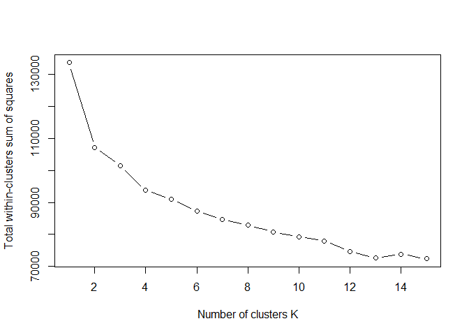
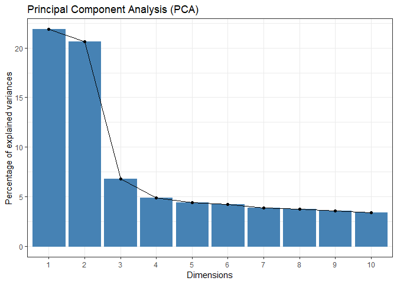
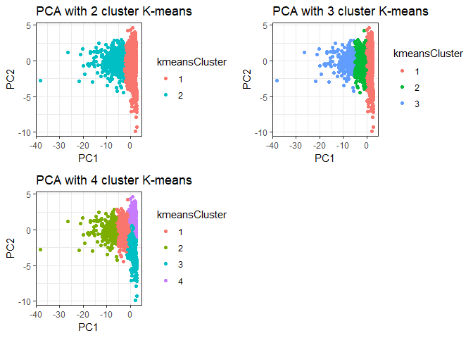
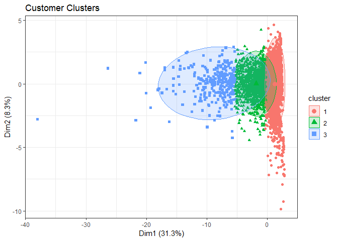

The purpose of this analysis is to identify separate groups of clients
that show different shopping behaviors. Based on the available data and
using some methods is possible to extract some specific customer
profiles.

Customer segmentation is the process of dividing customers into groups
based upon certain boundaries; clustering is one way to generate these
boundaries. <strong><em>Algorithms selected</em></strong>: K-means,
Principal Component Analysis (PCA)

   

<em>Data preparation to segmentation analysis</em>
--------------------------------------------------

The data should be prepared. In the beginning, add some new variables
about the amount of purchase, product choice.  The new variables are:

-   minBasket  
-   avgBasket  
-   maxBasket  
-   totalBasket  
-   nBasket  
-   the amout of purchase each product of category number one
    (`totalCategory1`, `totalCategory2` ...)

The data is aggregated by the column assigned `User_ID`.    

<table class="table" style="margin-left: auto; margin-right: auto;">
<thead>
<tr>
<th style="text-align:right;">
User\_ID
</th>
<th style="text-align:left;">
Gender
</th>
<th style="text-align:left;">
Age
</th>
<th style="text-align:right;">
Occupation
</th>
<th style="text-align:left;">
City\_Category
</th>
<th style="text-align:left;">
Stay\_In\_Current\_City\_Years
</th>
<th style="text-align:right;">
Marital\_Status
</th>
<th style="text-align:right;">
minBasket
</th>
<th style="text-align:right;">
avgBasket
</th>
<th style="text-align:right;">
maxBasket
</th>
<th style="text-align:right;">
totalBasket
</th>
<th style="text-align:right;">
nBasket
</th>
<th style="text-align:right;">
totalCategory`1`
</th>
<th style="text-align:right;">
totalCategory`10`
</th>
<th style="text-align:right;">
totalCategory`11`
</th>
<th style="text-align:right;">
totalCategory`12`
</th>
<th style="text-align:right;">
totalCategory`13`
</th>
<th style="text-align:right;">
totalCategory`14`
</th>
<th style="text-align:right;">
totalCategory`15`
</th>
<th style="text-align:right;">
totalCategory`16`
</th>
<th style="text-align:right;">
totalCategory`17`
</th>
<th style="text-align:right;">
totalCategory`18`
</th>
<th style="text-align:right;">
totalCategory`2`
</th>
<th style="text-align:right;">
totalCategory`3`
</th>
<th style="text-align:right;">
totalCategory`4`
</th>
<th style="text-align:right;">
totalCategory`5`
</th>
<th style="text-align:right;">
totalCategory`6`
</th>
<th style="text-align:right;">
totalCategory`7`
</th>
<th style="text-align:right;">
totalCategory`8`
</th>
<th style="text-align:right;">
totalCategory`9`
</th>
</tr>
</thead>
<tbody>
<tr>
<td style="text-align:right;">
1000001
</td>
<td style="text-align:left;">
F
</td>
<td style="text-align:left;">
0-17
</td>
<td style="text-align:right;">
10
</td>
<td style="text-align:left;">
A
</td>
<td style="text-align:left;">
2
</td>
<td style="text-align:right;">
0
</td>
<td style="text-align:right;">
1422
</td>
<td style="text-align:right;">
8113.69
</td>
<td style="text-align:right;">
16446
</td>
<td style="text-align:right;">
105478
</td>
<td style="text-align:right;">
13
</td>
<td style="text-align:right;">
0
</td>
<td style="text-align:right;">
0
</td>
<td style="text-align:right;">
0
</td>
<td style="text-align:right;">
3137
</td>
<td style="text-align:right;">
0
</td>
<td style="text-align:right;">
11011
</td>
<td style="text-align:right;">
0
</td>
<td style="text-align:right;">
16446
</td>
<td style="text-align:right;">
0
</td>
<td style="text-align:right;">
0
</td>
<td style="text-align:right;">
0
</td>
<td style="text-align:right;">
8370
</td>
<td style="text-align:right;">
0
</td>
<td style="text-align:right;">
6910
</td>
<td style="text-align:right;">
0
</td>
<td style="text-align:right;">
0
</td>
<td style="text-align:right;">
59604
</td>
<td style="text-align:right;">
0
</td>
</tr>
<tr>
<td style="text-align:right;">
1000002
</td>
<td style="text-align:left;">
M
</td>
<td style="text-align:left;">
55+
</td>
<td style="text-align:right;">
16
</td>
<td style="text-align:left;">
C
</td>
<td style="text-align:left;">
4+
</td>
<td style="text-align:right;">
0
</td>
<td style="text-align:right;">
4123
</td>
<td style="text-align:right;">
8261.59
</td>
<td style="text-align:right;">
11812
</td>
<td style="text-align:right;">
181755
</td>
<td style="text-align:right;">
22
</td>
<td style="text-align:right;">
11812
</td>
<td style="text-align:right;">
0
</td>
<td style="text-align:right;">
0
</td>
<td style="text-align:right;">
0
</td>
<td style="text-align:right;">
0
</td>
<td style="text-align:right;">
0
</td>
<td style="text-align:right;">
0
</td>
<td style="text-align:right;">
0
</td>
<td style="text-align:right;">
0
</td>
<td style="text-align:right;">
0
</td>
<td style="text-align:right;">
0
</td>
<td style="text-align:right;">
0
</td>
<td style="text-align:right;">
0
</td>
<td style="text-align:right;">
17583
</td>
<td style="text-align:right;">
0
</td>
<td style="text-align:right;">
0
</td>
<td style="text-align:right;">
152360
</td>
<td style="text-align:right;">
0
</td>
</tr>
<tr>
<td style="text-align:right;">
1000003
</td>
<td style="text-align:left;">
M
</td>
<td style="text-align:left;">
26-35
</td>
<td style="text-align:right;">
15
</td>
<td style="text-align:left;">
A
</td>
<td style="text-align:left;">
3
</td>
<td style="text-align:right;">
0
</td>
<td style="text-align:right;">
3854
</td>
<td style="text-align:right;">
6813.50
</td>
<td style="text-align:right;">
8845
</td>
<td style="text-align:right;">
40881
</td>
<td style="text-align:right;">
6
</td>
<td style="text-align:right;">
0
</td>
<td style="text-align:right;">
0
</td>
<td style="text-align:right;">
0
</td>
<td style="text-align:right;">
0
</td>
<td style="text-align:right;">
0
</td>
<td style="text-align:right;">
0
</td>
<td style="text-align:right;">
0
</td>
<td style="text-align:right;">
0
</td>
<td style="text-align:right;">
0
</td>
<td style="text-align:right;">
3854
</td>
<td style="text-align:right;">
0
</td>
<td style="text-align:right;">
0
</td>
<td style="text-align:right;">
0
</td>
<td style="text-align:right;">
37027
</td>
<td style="text-align:right;">
0
</td>
<td style="text-align:right;">
0
</td>
<td style="text-align:right;">
0
</td>
<td style="text-align:right;">
0
</td>
</tr>
<tr>
<td style="text-align:right;">
1000004
</td>
<td style="text-align:left;">
M
</td>
<td style="text-align:left;">
46-50
</td>
<td style="text-align:right;">
7
</td>
<td style="text-align:left;">
B
</td>
<td style="text-align:left;">
2
</td>
<td style="text-align:right;">
1
</td>
<td style="text-align:right;">
18988
</td>
<td style="text-align:right;">
18988.00
</td>
<td style="text-align:right;">
18988
</td>
<td style="text-align:right;">
18988
</td>
<td style="text-align:right;">
1
</td>
<td style="text-align:right;">
18988
</td>
<td style="text-align:right;">
0
</td>
<td style="text-align:right;">
0
</td>
<td style="text-align:right;">
0
</td>
<td style="text-align:right;">
0
</td>
<td style="text-align:right;">
0
</td>
<td style="text-align:right;">
0
</td>
<td style="text-align:right;">
0
</td>
<td style="text-align:right;">
0
</td>
<td style="text-align:right;">
0
</td>
<td style="text-align:right;">
0
</td>
<td style="text-align:right;">
0
</td>
<td style="text-align:right;">
0
</td>
<td style="text-align:right;">
0
</td>
<td style="text-align:right;">
0
</td>
<td style="text-align:right;">
0
</td>
<td style="text-align:right;">
0
</td>
<td style="text-align:right;">
0
</td>
</tr>
<tr>
<td style="text-align:right;">
1000005
</td>
<td style="text-align:left;">
M
</td>
<td style="text-align:left;">
26-35
</td>
<td style="text-align:right;">
20
</td>
<td style="text-align:left;">
A
</td>
<td style="text-align:left;">
1
</td>
<td style="text-align:right;">
1
</td>
<td style="text-align:right;">
2265
</td>
<td style="text-align:right;">
7754.44
</td>
<td style="text-align:right;">
21021
</td>
<td style="text-align:right;">
372213
</td>
<td style="text-align:right;">
48
</td>
<td style="text-align:right;">
11531
</td>
<td style="text-align:right;">
0
</td>
<td style="text-align:right;">
5895
</td>
<td style="text-align:right;">
0
</td>
<td style="text-align:right;">
0
</td>
<td style="text-align:right;">
11085
</td>
<td style="text-align:right;">
0
</td>
<td style="text-align:right;">
25195
</td>
<td style="text-align:right;">
0
</td>
<td style="text-align:right;">
0
</td>
<td style="text-align:right;">
0
</td>
<td style="text-align:right;">
0
</td>
<td style="text-align:right;">
0
</td>
<td style="text-align:right;">
52980
</td>
<td style="text-align:right;">
16421
</td>
<td style="text-align:right;">
74954
</td>
<td style="text-align:right;">
174152
</td>
<td style="text-align:right;">
0
</td>
</tr>
<tr>
<td style="text-align:right;">
1000006
</td>
<td style="text-align:left;">
F
</td>
<td style="text-align:left;">
51-55
</td>
<td style="text-align:right;">
9
</td>
<td style="text-align:left;">
A
</td>
<td style="text-align:left;">
1
</td>
<td style="text-align:right;">
0
</td>
<td style="text-align:right;">
1084
</td>
<td style="text-align:right;">
4517.50
</td>
<td style="text-align:right;">
9924
</td>
<td style="text-align:right;">
27105
</td>
<td style="text-align:right;">
6
</td>
<td style="text-align:right;">
0
</td>
<td style="text-align:right;">
0
</td>
<td style="text-align:right;">
0
</td>
<td style="text-align:right;">
1084
</td>
<td style="text-align:right;">
0
</td>
<td style="text-align:right;">
0
</td>
<td style="text-align:right;">
0
</td>
<td style="text-align:right;">
0
</td>
<td style="text-align:right;">
0
</td>
<td style="text-align:right;">
9183
</td>
<td style="text-align:right;">
0
</td>
<td style="text-align:right;">
0
</td>
<td style="text-align:right;">
0
</td>
<td style="text-align:right;">
6914
</td>
<td style="text-align:right;">
0
</td>
<td style="text-align:right;">
0
</td>
<td style="text-align:right;">
9924
</td>
<td style="text-align:right;">
0
</td>
</tr>
</tbody>
</table>

<em>K-means</em>
----------------

K-means clustering is a very simple and fast algorithm. To use this
popular method for customer segmentation is needed to use only numerical
data. The data must be scaled.    

<table class="table" style="margin-left: auto; margin-right: auto;">
<thead>
<tr>
<th style="text-align:right;">
minBasket
</th>
<th style="text-align:right;">
avgBasket
</th>
<th style="text-align:right;">
maxBasket
</th>
<th style="text-align:right;">
totalBasket
</th>
<th style="text-align:right;">
nBasket
</th>
<th style="text-align:right;">
totalCategory`1`
</th>
<th style="text-align:right;">
totalCategory`10`
</th>
<th style="text-align:right;">
totalCategory`11`
</th>
<th style="text-align:right;">
totalCategory`12`
</th>
<th style="text-align:right;">
totalCategory`13`
</th>
<th style="text-align:right;">
totalCategory`14`
</th>
<th style="text-align:right;">
totalCategory`15`
</th>
<th style="text-align:right;">
totalCategory`16`
</th>
<th style="text-align:right;">
totalCategory`17`
</th>
<th style="text-align:right;">
totalCategory`18`
</th>
<th style="text-align:right;">
totalCategory`2`
</th>
<th style="text-align:right;">
totalCategory`3`
</th>
<th style="text-align:right;">
totalCategory`4`
</th>
<th style="text-align:right;">
totalCategory`5`
</th>
<th style="text-align:right;">
totalCategory`6`
</th>
<th style="text-align:right;">
totalCategory`7`
</th>
<th style="text-align:right;">
totalCategory`8`
</th>
<th style="text-align:right;">
totalCategory`9`
</th>
</tr>
</thead>
<tbody>
<tr>
<td style="text-align:right;">
-0.7301878
</td>
<td style="text-align:right;">
-0.0159478
</td>
<td style="text-align:right;">
0.0628535
</td>
<td style="text-align:right;">
-0.4019547
</td>
<td style="text-align:right;">
-0.4080136
</td>
<td style="text-align:right;">
-0.4514205
</td>
<td style="text-align:right;">
-0.2205211
</td>
<td style="text-align:right;">
-0.3764859
</td>
<td style="text-align:right;">
2.2521728
</td>
<td style="text-align:right;">
-0.274772
</td>
<td style="text-align:right;">
1.1327140
</td>
<td style="text-align:right;">
-0.4331085
</td>
<td style="text-align:right;">
-0.1867021
</td>
<td style="text-align:right;">
-0.2357245
</td>
<td style="text-align:right;">
-0.3606122
</td>
<td style="text-align:right;">
-0.3098074
</td>
<td style="text-align:right;">
3.3143323
</td>
<td style="text-align:right;">
-0.1378165
</td>
<td style="text-align:right;">
-0.6358055
</td>
<td style="text-align:right;">
-0.3132542
</td>
<td style="text-align:right;">
-0.3583244
</td>
<td style="text-align:right;">
-0.1501933
</td>
<td style="text-align:right;">
-0.0131137
</td>
</tr>
<tr>
<td style="text-align:right;">
0.3387904
</td>
<td style="text-align:right;">
0.0504426
</td>
<td style="text-align:right;">
-0.8536170
</td>
<td style="text-align:right;">
-0.1365456
</td>
<td style="text-align:right;">
-0.1743649
</td>
<td style="text-align:right;">
-0.0864480
</td>
<td style="text-align:right;">
-0.2205211
</td>
<td style="text-align:right;">
-0.3764859
</td>
<td style="text-align:right;">
-0.3300304
</td>
<td style="text-align:right;">
-0.274772
</td>
<td style="text-align:right;">
-0.3113938
</td>
<td style="text-align:right;">
-0.4331085
</td>
<td style="text-align:right;">
-0.5623230
</td>
<td style="text-align:right;">
-0.2357245
</td>
<td style="text-align:right;">
-0.3606122
</td>
<td style="text-align:right;">
-0.3098074
</td>
<td style="text-align:right;">
-0.1979593
</td>
<td style="text-align:right;">
-0.1378165
</td>
<td style="text-align:right;">
-0.5207424
</td>
<td style="text-align:right;">
-0.3132542
</td>
<td style="text-align:right;">
-0.3583244
</td>
<td style="text-align:right;">
0.6375424
</td>
<td style="text-align:right;">
-0.0131137
</td>
</tr>
<tr>
<td style="text-align:right;">
0.2323280
</td>
<td style="text-align:right;">
-0.5995868
</td>
<td style="text-align:right;">
-1.4404033
</td>
<td style="text-align:right;">
-0.6267227
</td>
<td style="text-align:right;">
-0.5897405
</td>
<td style="text-align:right;">
-0.4514205
</td>
<td style="text-align:right;">
-0.2205211
</td>
<td style="text-align:right;">
-0.3764859
</td>
<td style="text-align:right;">
-0.3300304
</td>
<td style="text-align:right;">
-0.274772
</td>
<td style="text-align:right;">
-0.3113938
</td>
<td style="text-align:right;">
-0.4331085
</td>
<td style="text-align:right;">
-0.5623230
</td>
<td style="text-align:right;">
-0.2357245
</td>
<td style="text-align:right;">
0.5227215
</td>
<td style="text-align:right;">
-0.3098074
</td>
<td style="text-align:right;">
-0.1979593
</td>
<td style="text-align:right;">
-0.1378165
</td>
<td style="text-align:right;">
-0.3111211
</td>
<td style="text-align:right;">
-0.3132542
</td>
<td style="text-align:right;">
-0.3583244
</td>
<td style="text-align:right;">
-0.6563837
</td>
<td style="text-align:right;">
-0.0131137
</td>
</tr>
<tr>
<td style="text-align:right;">
6.2219306
</td>
<td style="text-align:right;">
4.8653936
</td>
<td style="text-align:right;">
0.5655872
</td>
<td style="text-align:right;">
-0.7029003
</td>
<td style="text-align:right;">
-0.7195453
</td>
<td style="text-align:right;">
0.1352794
</td>
<td style="text-align:right;">
-0.2205211
</td>
<td style="text-align:right;">
-0.3764859
</td>
<td style="text-align:right;">
-0.3300304
</td>
<td style="text-align:right;">
-0.274772
</td>
<td style="text-align:right;">
-0.3113938
</td>
<td style="text-align:right;">
-0.4331085
</td>
<td style="text-align:right;">
-0.5623230
</td>
<td style="text-align:right;">
-0.2357245
</td>
<td style="text-align:right;">
-0.3606122
</td>
<td style="text-align:right;">
-0.3098074
</td>
<td style="text-align:right;">
-0.1979593
</td>
<td style="text-align:right;">
-0.1378165
</td>
<td style="text-align:right;">
-0.7103007
</td>
<td style="text-align:right;">
-0.3132542
</td>
<td style="text-align:right;">
-0.3583244
</td>
<td style="text-align:right;">
-0.6563837
</td>
<td style="text-align:right;">
-0.0131137
</td>
</tr>
<tr>
<td style="text-align:right;">
-0.3965526
</td>
<td style="text-align:right;">
-0.1772106
</td>
<td style="text-align:right;">
0.9676555
</td>
<td style="text-align:right;">
0.5261611
</td>
<td style="text-align:right;">
0.5006204
</td>
<td style="text-align:right;">
-0.0951304
</td>
<td style="text-align:right;">
-0.2205211
</td>
<td style="text-align:right;">
-0.1502606
</td>
<td style="text-align:right;">
-0.3300304
</td>
<td style="text-align:right;">
-0.274772
</td>
<td style="text-align:right;">
1.1424192
</td>
<td style="text-align:right;">
-0.4331085
</td>
<td style="text-align:right;">
0.0131221
</td>
<td style="text-align:right;">
-0.2357245
</td>
<td style="text-align:right;">
-0.3606122
</td>
<td style="text-align:right;">
-0.3098074
</td>
<td style="text-align:right;">
-0.1979593
</td>
<td style="text-align:right;">
-0.1378165
</td>
<td style="text-align:right;">
-0.1391354
</td>
<td style="text-align:right;">
1.7906679
</td>
<td style="text-align:right;">
2.4468458
</td>
<td style="text-align:right;">
0.8226122
</td>
<td style="text-align:right;">
-0.0131137
</td>
</tr>
<tr>
<td style="text-align:right;">
-0.8639585
</td>
<td style="text-align:right;">
-1.6302324
</td>
<td style="text-align:right;">
-1.2270085
</td>
<td style="text-align:right;">
-0.6746569
</td>
<td style="text-align:right;">
-0.5897405
</td>
<td style="text-align:right;">
-0.4514205
</td>
<td style="text-align:right;">
-0.2205211
</td>
<td style="text-align:right;">
-0.3764859
</td>
<td style="text-align:right;">
0.5622578
</td>
<td style="text-align:right;">
-0.274772
</td>
<td style="text-align:right;">
-0.3113938
</td>
<td style="text-align:right;">
-0.4331085
</td>
<td style="text-align:right;">
-0.5623230
</td>
<td style="text-align:right;">
-0.2357245
</td>
<td style="text-align:right;">
1.7441240
</td>
<td style="text-align:right;">
-0.3098074
</td>
<td style="text-align:right;">
-0.1979593
</td>
<td style="text-align:right;">
-0.1378165
</td>
<td style="text-align:right;">
-0.6357624
</td>
<td style="text-align:right;">
-0.3132542
</td>
<td style="text-align:right;">
-0.3583244
</td>
<td style="text-align:right;">
-0.5721036
</td>
<td style="text-align:right;">
-0.0131137
</td>
</tr>
</tbody>
</table>

   

### <em>To define an optimal number of clusters</em>

-   Elbow method  
    The elbow method looks at the percentage of variance explained as a
    function of the number of clusters.   The second cluster will add
    much information (explain a lot of variances).  K=3 should be a
    good choice for number of clusters however k=4 also seems to be a
    potential candidate.

  
 

### <em>Results of analysis with 3 and 4 clusters</em>

   

#### 2 clusters

    ##    minBasket  avgBasket  maxBasket totalBasket    nBasket totalCategory`1`
    ## 1  0.1027617  0.0216086 -0.1130669   -0.281919 -0.2793808       -0.1713916
    ## 2 -0.8109373 -0.1705229  0.8922603    2.224746  2.2047162        1.3525262
    ##   totalCategory`10` totalCategory`11` totalCategory`12` totalCategory`13`
    ## 1       -0.08702068        -0.1433182        -0.1226665        -0.1364594
    ## 2        0.68671825         1.1309869         0.9680150         1.0768611
    ##   totalCategory`14` totalCategory`15` totalCategory`16` totalCategory`17`
    ## 1         -0.117978        -0.1402581        -0.2065164        -0.1055117
    ## 2          0.931016         1.1068381         1.6297112         0.8326389
    ##   totalCategory`18` totalCategory`2` totalCategory`3` totalCategory`4`
    ## 1        -0.1569932       -0.1518431      -0.05766258      -0.06194943
    ## 2         1.2389017        1.1982607       0.45504060       0.48887008
    ##   totalCategory`5` totalCategory`6` totalCategory`7` totalCategory`8`
    ## 1       -0.2413356       -0.1426255       -0.1575578       -0.2435875
    ## 2        1.9044846        1.1255199        1.2433578        1.9222556
    ##   totalCategory`9`
    ## 1       -0.0131137
    ## 2        0.1034859

    ## 
    ##    1    2 
    ## 5161  654

#### 3 clusters

    ##    minBasket   avgBasket  maxBasket totalBasket    nBasket
    ## 1  0.2650299  0.04220978 -0.3055098  -0.4467787 -0.4391957
    ## 2 -0.6073953 -0.08916298  0.7160669   0.6544777  0.6421105
    ## 3 -0.8783410 -0.17690462  0.9347825   3.2864416  3.2368159
    ##   totalCategory`1` totalCategory`10` totalCategory`11` totalCategory`12`
    ## 1       -0.2599621        -0.1556531        -0.2348877        -0.2059378
    ## 2        0.3388375         0.2747118         0.3177685         0.3224670
    ## 3        2.1174131         0.9167141         1.8564170         1.4132214
    ##   totalCategory`13` totalCategory`14` totalCategory`15` totalCategory`16`
    ## 1        -0.2154017        -0.1969255        -0.2406974        -0.3131628
    ## 2         0.3053715         0.2664267         0.3831207         0.3867541
    ## 3         1.6341550         1.5563099         1.6213273         2.6554601
    ##   totalCategory`17` totalCategory`18` totalCategory`2` totalCategory`3`
    ## 1        -0.1610529        -0.2476382       -0.2203631       -0.1223134
    ## 2         0.2495004         0.3643780        0.2961186        0.2176095
    ## 3         1.1183224         1.8136872        1.7513996        0.7118618
    ##   totalCategory`4` totalCategory`5` totalCategory`6` totalCategory`7`
    ## 1      -0.08117852       -0.3937202       -0.2055953       -0.2499866
    ## 2       0.07229376        0.6368525        0.2302338        0.3859316
    ## 3       0.82501867        2.6024041        1.8590600        1.7424268
    ##   totalCategory`8` totalCategory`9`
    ## 1       -0.3814510       -0.0131137
    ## 2        0.5500762       -0.0131137
    ## 3        2.8484436        0.2544517

    ## 
    ##    1    2    3 
    ## 4137 1393  285

#### 4 clusters

    ##     minBasket  avgBasket  maxBasket totalBasket    nBasket
    ## 1 -0.66878603 -0.1704320  0.7185437   0.8208743  0.8212430
    ## 2 -0.88496635 -0.1793549  0.9419818   3.3864136  3.3382547
    ## 3  0.42406440  0.7770992  0.6009763  -0.3360175 -0.3902833
    ## 4  0.03849813 -0.6316604 -1.0450202  -0.4874129 -0.4304580
    ##   totalCategory`1` totalCategory`10` totalCategory`11` totalCategory`12`
    ## 1       0.40536524        0.29344777         0.3766996         0.4138682
    ## 2       2.21230099        0.97213550         1.9738115         1.4486448
    ## 3      -0.09308252       -0.04722681        -0.2395603        -0.2387388
    ## 4      -0.37211877       -0.21610893        -0.1908219        -0.1500475
    ##   totalCategory`13` totalCategory`14` totalCategory`15` totalCategory`16`
    ## 1         0.4112766         0.3246633        0.38016790        0.47095369
    ## 2         1.7333130         1.5947265        1.76577747        2.78330311
    ## 3        -0.2155313        -0.1026573       -0.01643187       -0.09213033
    ## 4        -0.2035616        -0.2509228       -0.38080532       -0.47207512
    ##   totalCategory`17` totalCategory`18` totalCategory`2` totalCategory`3`
    ## 1         0.2978886         0.4454007        0.3653859       0.18770538
    ## 2         1.1445087         1.9190656        1.8862697       0.73332575
    ## 3        -0.1161941        -0.2414964       -0.1660603      -0.01106161
    ## 4        -0.1726266        -0.2175931       -0.2448852      -0.16927407
    ##   totalCategory`4` totalCategory`5` totalCategory`6` totalCategory`7`
    ## 1       0.12698463        0.8206659        0.3187531       0.43076429
    ## 2       0.79887990        2.6404765        1.8645629       1.81433030
    ## 3      -0.11297491       -0.3828107       -0.1251273      -0.09947694
    ## 4      -0.04905579       -0.3569592       -0.2576102      -0.33314157
    ##   totalCategory`8` totalCategory`9`
    ## 1        0.7191843       -0.0131137
    ## 2        2.9066519        0.2801792
    ## 3       -0.3377129       -0.0131137
    ## 4       -0.3789047       -0.0131137

    ## 
    ##    1    2    3    4 
    ## 1148  260 2148 2259

   

<em>Perform PCA to visualize the clusters</em>
----------------------------------------------

PCA 1 and PCA 2 combined explain the majority of the data variance and
then there is a drop from PCA 2 to PCA 3.  
Including more PCA’s after PCA 3 will only result in minimal
improvement.

-   <em>PCA with 2,3 and 4 cluster K-means</em>

