Data structure
==============

In dataset are 12 columns. The dataset contains different kinds of
variables - numerical or categorical. I used my function
`DescribeVariables()` to get more infromations about structure of data.
You can find code of this function in script prepare\_data\_func.R  
Here the results:    

<table class="table" style="margin-left: auto; margin-right: auto;">
<caption>
Table 1: Structure of data
</caption>
<thead>
<tr>
<th style="text-align:left;font-weight: bold;">
variable
</th>
<th style="text-align:left;font-weight: bold;">
type
</th>
<th style="text-align:right;font-weight: bold;">
numberOfNa
</th>
<th style="text-align:right;font-weight: bold;">
p\_numberOfNa
</th>
<th style="text-align:right;font-weight: bold;">
uniqueValues
</th>
<th style="text-align:right;font-weight: bold;">
p\_uniqueValues
</th>
<th style="text-align:right;font-weight: bold;">
zeros
</th>
<th style="text-align:right;font-weight: bold;">
p\_zeros
</th>
</tr>
</thead>
<tbody>
<tr>
<td style="text-align:left;width: 8cm; font-weight: bold;color: red;">
User\_ID
</td>
<td style="text-align:left;">
integer
</td>
<td style="text-align:right;">
0
</td>
<td style="text-align:right;">
0.0000000
</td>
<td style="text-align:right;">
5891
</td>
<td style="text-align:right;">
0.0109584
</td>
<td style="text-align:right;">
0
</td>
<td style="text-align:right;">
0.0000000
</td>
</tr>
<tr>
<td style="text-align:left;width: 8cm; font-weight: bold;color: red;">
Product\_ID
</td>
<td style="text-align:left;">
factor
</td>
<td style="text-align:right;">
0
</td>
<td style="text-align:right;">
0.0000000
</td>
<td style="text-align:right;">
3623
</td>
<td style="text-align:right;">
0.0067395
</td>
<td style="text-align:right;">
0
</td>
<td style="text-align:right;">
0.0000000
</td>
</tr>
<tr>
<td style="text-align:left;width: 8cm; font-weight: bold;color: red;">
Gender
</td>
<td style="text-align:left;">
factor
</td>
<td style="text-align:right;">
0
</td>
<td style="text-align:right;">
0.0000000
</td>
<td style="text-align:right;">
2
</td>
<td style="text-align:right;">
0.0000037
</td>
<td style="text-align:right;">
0
</td>
<td style="text-align:right;">
0.0000000
</td>
</tr>
<tr>
<td style="text-align:left;width: 8cm; font-weight: bold;color: red;">
Age
</td>
<td style="text-align:left;">
factor
</td>
<td style="text-align:right;">
0
</td>
<td style="text-align:right;">
0.0000000
</td>
<td style="text-align:right;">
7
</td>
<td style="text-align:right;">
0.0000130
</td>
<td style="text-align:right;">
0
</td>
<td style="text-align:right;">
0.0000000
</td>
</tr>
<tr>
<td style="text-align:left;width: 8cm; font-weight: bold;color: red;">
Occupation
</td>
<td style="text-align:left;">
integer
</td>
<td style="text-align:right;">
0
</td>
<td style="text-align:right;">
0.0000000
</td>
<td style="text-align:right;">
21
</td>
<td style="text-align:right;">
0.0000391
</td>
<td style="text-align:right;">
68120
</td>
<td style="text-align:right;">
0.1267167
</td>
</tr>
<tr>
<td style="text-align:left;width: 8cm; font-weight: bold;color: red;">
City\_Category
</td>
<td style="text-align:left;">
factor
</td>
<td style="text-align:right;">
0
</td>
<td style="text-align:right;">
0.0000000
</td>
<td style="text-align:right;">
3
</td>
<td style="text-align:right;">
0.0000056
</td>
<td style="text-align:right;">
0
</td>
<td style="text-align:right;">
0.0000000
</td>
</tr>
<tr>
<td style="text-align:left;width: 8cm; font-weight: bold;color: red;">
Stay\_In\_Current\_City\_Years
</td>
<td style="text-align:left;">
factor
</td>
<td style="text-align:right;">
0
</td>
<td style="text-align:right;">
0.0000000
</td>
<td style="text-align:right;">
5
</td>
<td style="text-align:right;">
0.0000093
</td>
<td style="text-align:right;">
72725
</td>
<td style="text-align:right;">
0.1352829
</td>
</tr>
<tr>
<td style="text-align:left;width: 8cm; font-weight: bold;color: red;">
Marital\_Status
</td>
<td style="text-align:left;">
integer
</td>
<td style="text-align:right;">
0
</td>
<td style="text-align:right;">
0.0000000
</td>
<td style="text-align:right;">
2
</td>
<td style="text-align:right;">
0.0000037
</td>
<td style="text-align:right;">
317817
</td>
<td style="text-align:right;">
0.5912027
</td>
</tr>
<tr>
<td style="text-align:left;width: 8cm; font-weight: bold;color: red;">
Product\_Category\_1
</td>
<td style="text-align:left;">
integer
</td>
<td style="text-align:right;">
0
</td>
<td style="text-align:right;">
0.0000000
</td>
<td style="text-align:right;">
18
</td>
<td style="text-align:right;">
0.0000335
</td>
<td style="text-align:right;">
0
</td>
<td style="text-align:right;">
0.0000000
</td>
</tr>
<tr>
<td style="text-align:left;width: 8cm; font-weight: bold;color: red;">
Product\_Category\_2
</td>
<td style="text-align:left;">
integer
</td>
<td style="text-align:right;">
166986
</td>
<td style="text-align:right;">
0.3106271
</td>
<td style="text-align:right;">
18
</td>
<td style="text-align:right;">
0.0000335
</td>
<td style="text-align:right;">
NA
</td>
<td style="text-align:right;">
NA
</td>
</tr>
<tr>
<td style="text-align:left;width: 8cm; font-weight: bold;color: red;">
Product\_Category\_3
</td>
<td style="text-align:left;">
integer
</td>
<td style="text-align:right;">
373299
</td>
<td style="text-align:right;">
0.6944103
</td>
<td style="text-align:right;">
16
</td>
<td style="text-align:right;">
0.0000298
</td>
<td style="text-align:right;">
NA
</td>
<td style="text-align:right;">
NA
</td>
</tr>
<tr>
<td style="text-align:left;width: 8cm; font-weight: bold;color: red;">
Purchase
</td>
<td style="text-align:left;">
integer
</td>
<td style="text-align:right;">
0
</td>
<td style="text-align:right;">
0.0000000
</td>
<td style="text-align:right;">
17959
</td>
<td style="text-align:right;">
0.0334073
</td>
<td style="text-align:right;">
0
</td>
<td style="text-align:right;">
0.0000000
</td>
</tr>
</tbody>
</table>
   

Type of variables: *Occupation*, *Product\_Category\_1*,
*Product\_Category\_2* and *Marital\_Status* is integer. It needed to
conver types this variables to factor.

    data$Occupation         <- factor(data$Occupation,         levels = sort(unique(data$Occupation)))
    data$Product_Category_1 <- factor(data$Product_Category_1, levels = sort(unique(data$Product_Category_1)))
    data$Product_Category_2 <- factor(data$Product_Category_2, levels = sort(unique(data$Product_Category_2)))
    data$Product_Category_3 <- factor(data$Product_Category_3, levels = sort(unique(data$Product_Category_3)))
    data$Marital_Status     <- factor(data$Marital_Status,     levels = sort(unique(data$Marital_Status)))

    save(data, file = file.path(pathData, "data.Rdata"))

  Checking for NA values in columns we can see that the column
*Product\_Category\_2* is fill by 31% of NA values and the column
*Product\_Category\_3* is fill by 69% NA values. We have got colum
User\_ID to identify each customer. We have got 3 623 unique products in
data (*Product\_ID*).

       

Exploratory Data Analysis
=========================

   

Purchase
--------

   
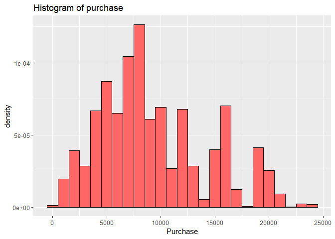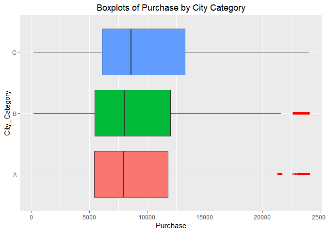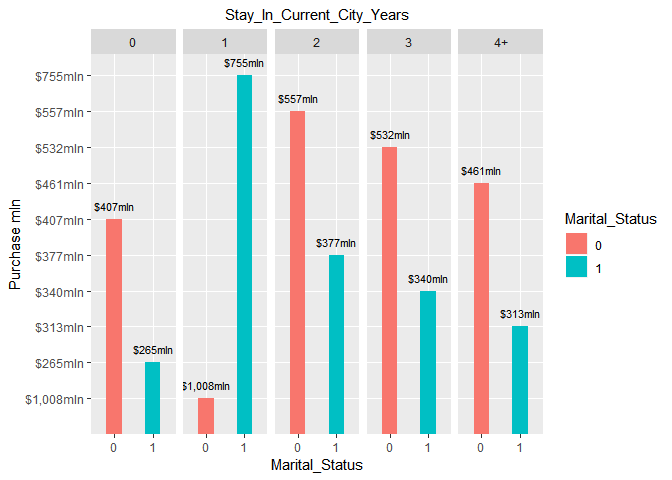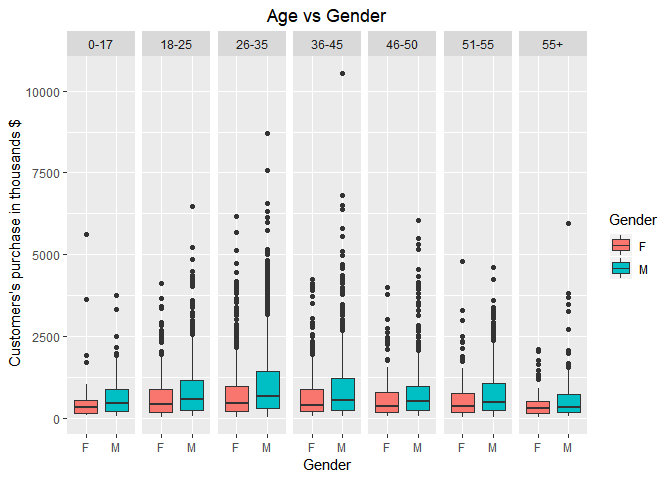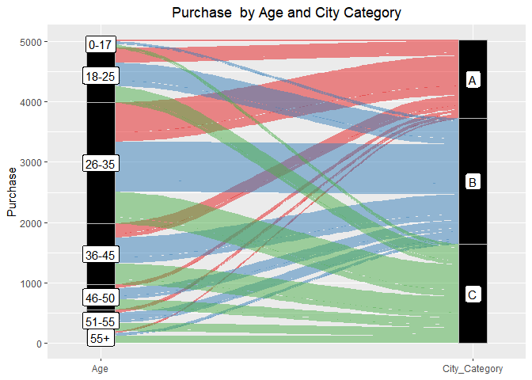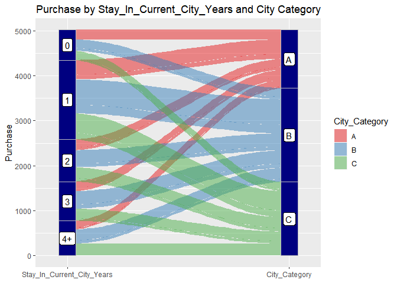
       

Customers
---------

   

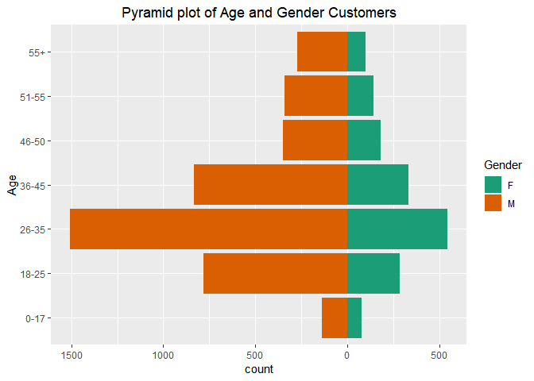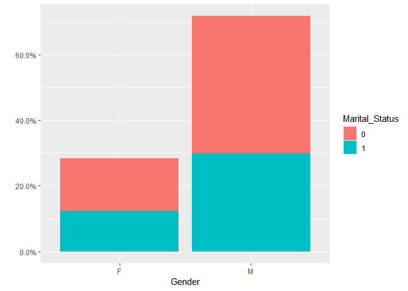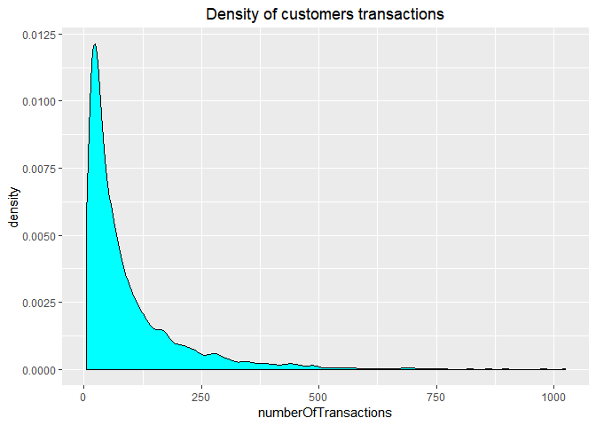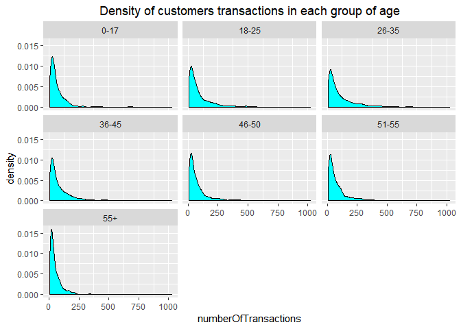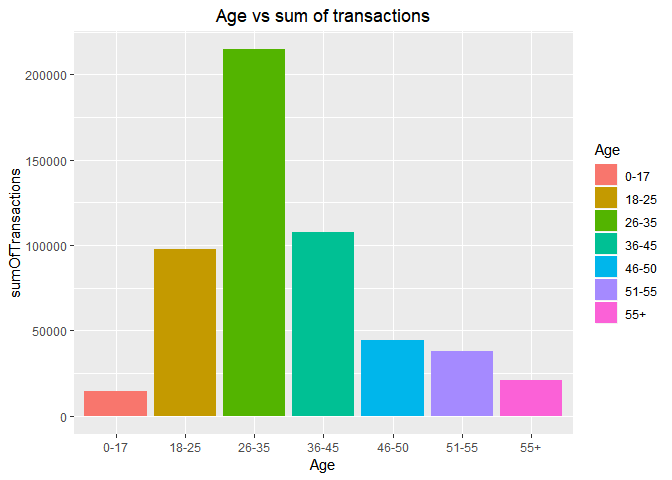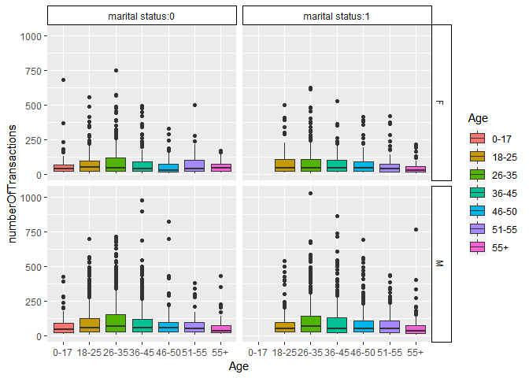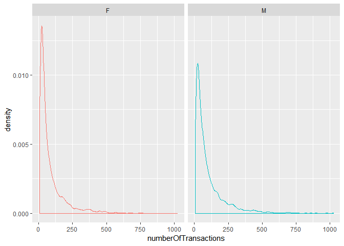
       

Products
--------

     

<table>
<thead>
<tr class="header">
<th align="left">Product_Category_1</th>
<th align="right">numberOfProducts</th>
<th align="right">percentage</th>
</tr>
</thead>
<tbody>
<tr class="odd">
<td align="left">5</td>
<td align="right">148592</td>
<td align="right">0.28</td>
</tr>
<tr class="even">
<td align="left">1</td>
<td align="right">138353</td>
<td align="right">0.26</td>
</tr>
<tr class="odd">
<td align="left">8</td>
<td align="right">112132</td>
<td align="right">0.21</td>
</tr>
<tr class="even">
<td align="left">11</td>
<td align="right">23960</td>
<td align="right">0.04</td>
</tr>
<tr class="odd">
<td align="left">2</td>
<td align="right">23499</td>
<td align="right">0.04</td>
</tr>
<tr class="even">
<td align="left">6</td>
<td align="right">20164</td>
<td align="right">0.04</td>
</tr>
<tr class="odd">
<td align="left">3</td>
<td align="right">19849</td>
<td align="right">0.04</td>
</tr>
<tr class="even">
<td align="left">4</td>
<td align="right">11567</td>
<td align="right">0.02</td>
</tr>
<tr class="odd">
<td align="left">16</td>
<td align="right">9697</td>
<td align="right">0.02</td>
</tr>
<tr class="even">
<td align="left">15</td>
<td align="right">6203</td>
<td align="right">0.01</td>
</tr>
</tbody>
</table>

<table>
<thead>
<tr class="header">
<th align="left">Product_Category_2</th>
<th align="right">numberOfProducts</th>
<th align="right">percentage</th>
</tr>
</thead>
<tbody>
<tr class="odd">
<td align="left">NA</td>
<td align="right">166986</td>
<td align="right">0.31</td>
</tr>
<tr class="even">
<td align="left">8</td>
<td align="right">63058</td>
<td align="right">0.12</td>
</tr>
<tr class="odd">
<td align="left">14</td>
<td align="right">54158</td>
<td align="right">0.10</td>
</tr>
<tr class="even">
<td align="left">2</td>
<td align="right">48481</td>
<td align="right">0.09</td>
</tr>
<tr class="odd">
<td align="left">16</td>
<td align="right">42602</td>
<td align="right">0.08</td>
</tr>
<tr class="even">
<td align="left">15</td>
<td align="right">37317</td>
<td align="right">0.07</td>
</tr>
<tr class="odd">
<td align="left">5</td>
<td align="right">25874</td>
<td align="right">0.05</td>
</tr>
<tr class="even">
<td align="left">4</td>
<td align="right">25225</td>
<td align="right">0.05</td>
</tr>
<tr class="odd">
<td align="left">6</td>
<td align="right">16251</td>
<td align="right">0.03</td>
</tr>
<tr class="even">
<td align="left">11</td>
<td align="right">13945</td>
<td align="right">0.03</td>
</tr>
</tbody>
</table>

<table>
<thead>
<tr class="header">
<th align="left">Product_Category_3</th>
<th align="right">numberOfProducts</th>
<th align="right">percentage</th>
</tr>
</thead>
<tbody>
<tr class="odd">
<td align="left">NA</td>
<td align="right">373299</td>
<td align="right">0.69</td>
</tr>
<tr class="even">
<td align="left">16</td>
<td align="right">32148</td>
<td align="right">0.06</td>
</tr>
<tr class="odd">
<td align="left">15</td>
<td align="right">27611</td>
<td align="right">0.05</td>
</tr>
<tr class="even">
<td align="left">14</td>
<td align="right">18121</td>
<td align="right">0.03</td>
</tr>
<tr class="odd">
<td align="left">17</td>
<td align="right">16449</td>
<td align="right">0.03</td>
</tr>
<tr class="even">
<td align="left">5</td>
<td align="right">16380</td>
<td align="right">0.03</td>
</tr>
<tr class="odd">
<td align="left">8</td>
<td align="right">12384</td>
<td align="right">0.02</td>
</tr>
<tr class="even">
<td align="left">9</td>
<td align="right">11414</td>
<td align="right">0.02</td>
</tr>
<tr class="odd">
<td align="left">12</td>
<td align="right">9094</td>
<td align="right">0.02</td>
</tr>
<tr class="even">
<td align="left">13</td>
<td align="right">5385</td>
<td align="right">0.01</td>
</tr>
</tbody>
</table>

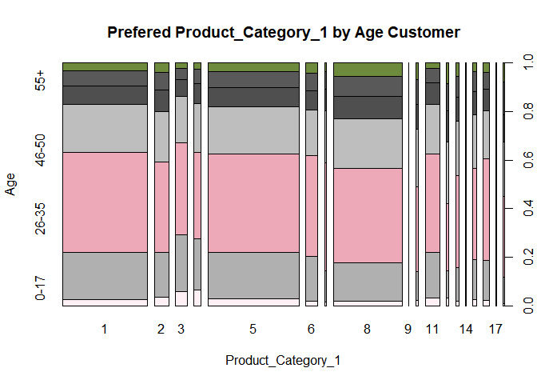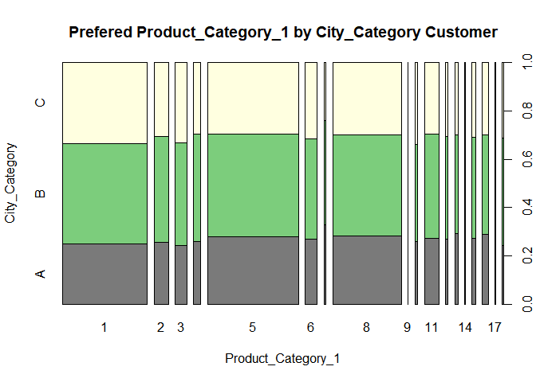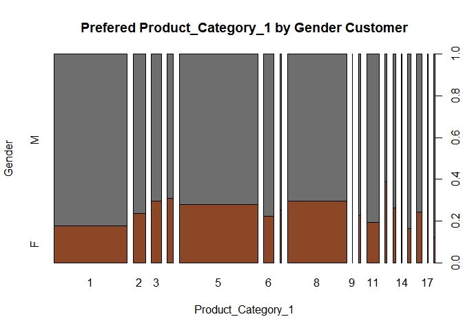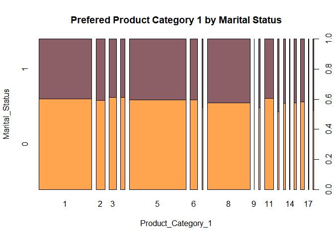
